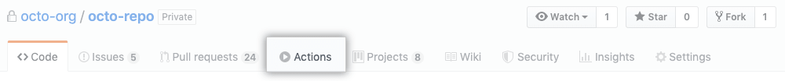
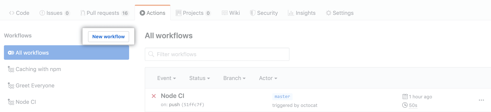
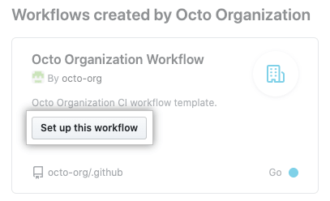

# GitHub Actions

🤖 GitHub Actions workflow template.

## 💬 How to use?

1. Fork this repository to your organization or yourself.

2. Navigate to the main page of the repository what you want to add.

3. Under the repository, click <kbd>Actions</kbd>.

4. If your repository already has existing workflows: In the upper-left corner, click <kbd>New workflow</kbd>.

5. Under the name of the template you'd like to use, click <kbd>Set up this workflow</kbd>.

## 📚 Reference
- [GitHub docs](https://docs.github.com/en/free-pro-team@latest/actions/learn-github-actions/sharing-workflows-with-your-organization)